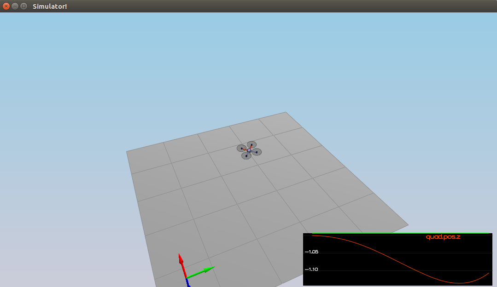
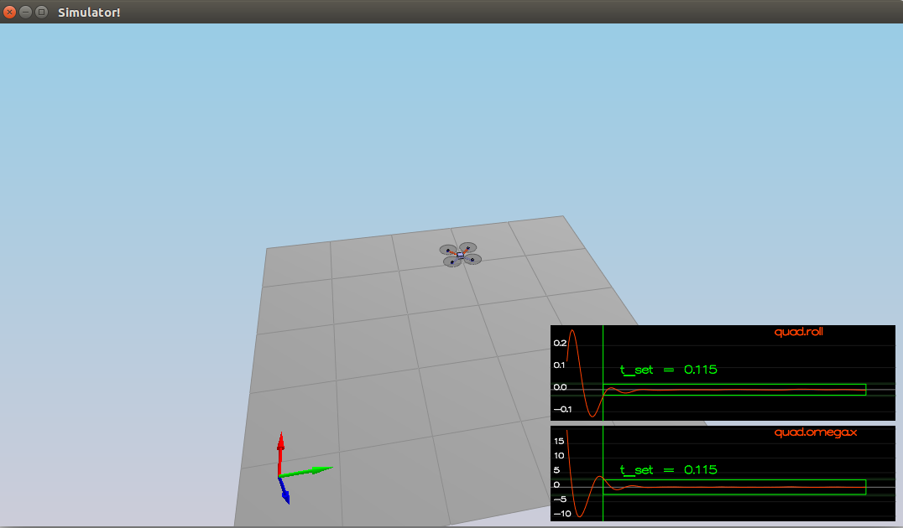
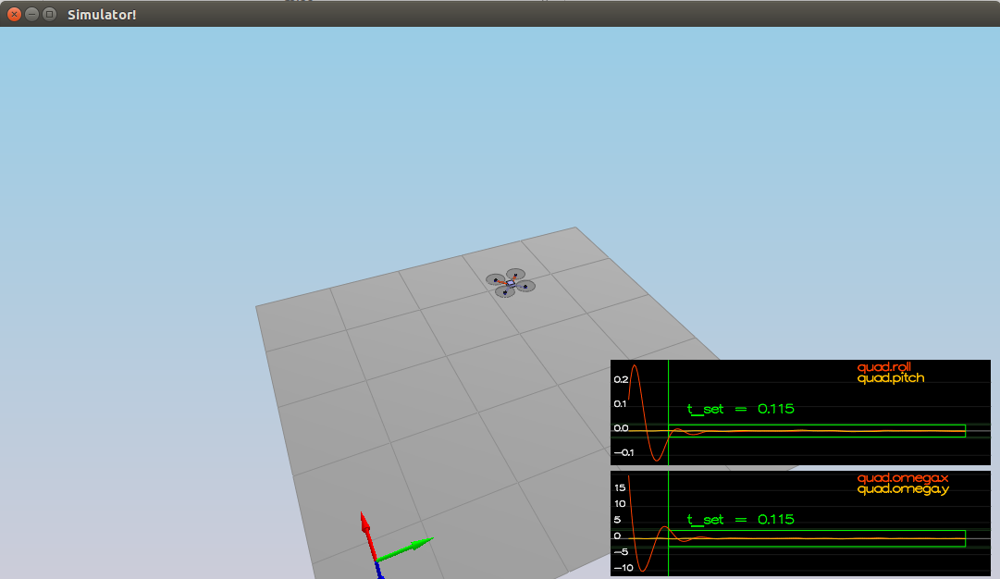
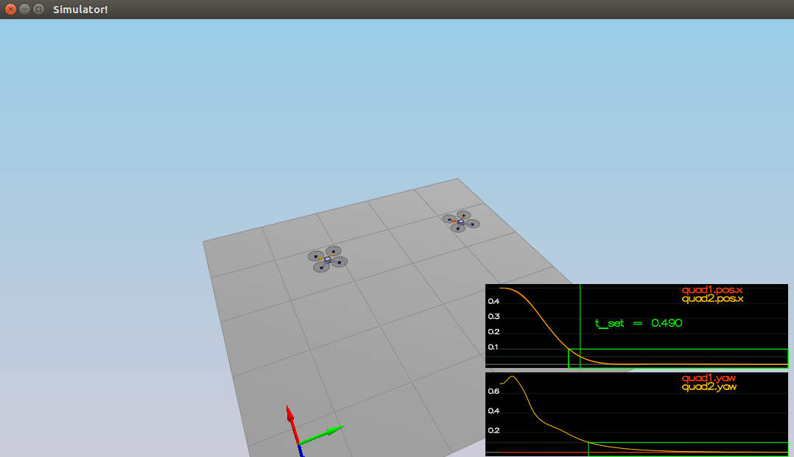
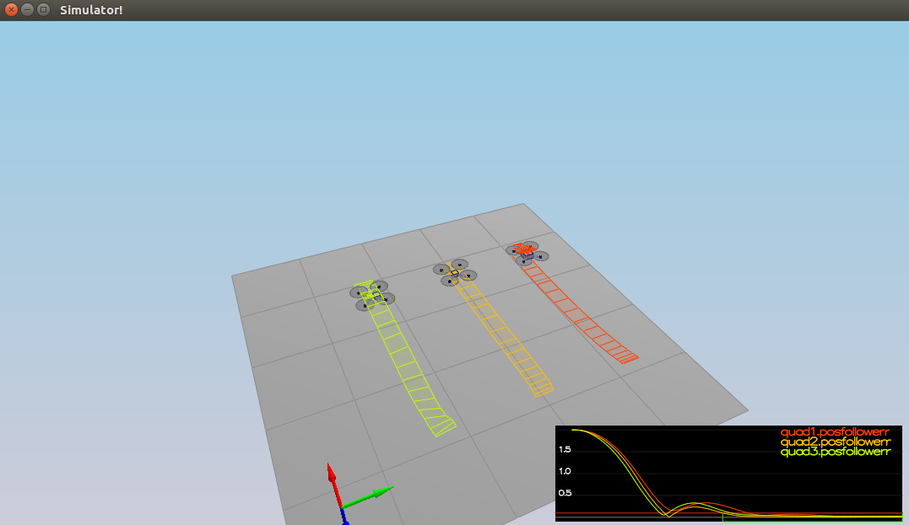
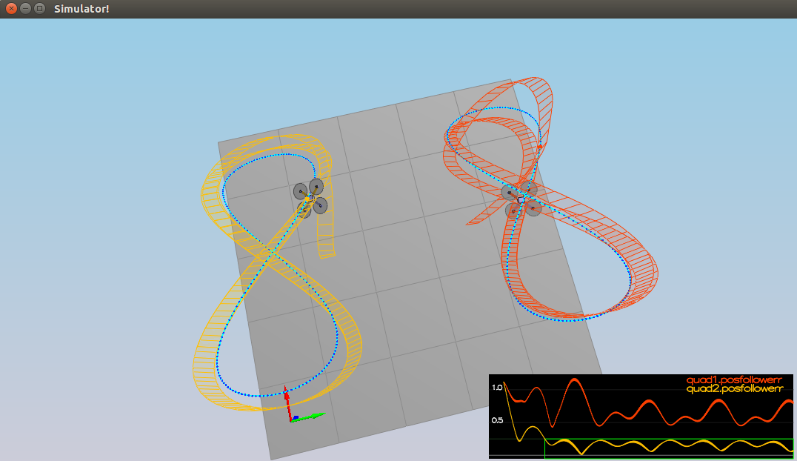

## Project: Control of a 3D Quadrotor

### Writeup / README

#### 1. Provide a Writeup / README that includes all the rubric points and how you addressed each one.  You can submit your writeup as markdown or pdf.  

You're reading it! Below I describe how I addressed each rubric point and where in my code each point is handled.

### Testing it Out

#### 1. Tune the Mass parameter in QuadControlParams.txt to make the vehicle more or less stay in the same spot.
I tuned Mass parameter as 0.52.

### Body rate and roll/pitch control (scenario 2)

#### 1. Implement body rate control 
`GenerateMotorCommands` function is implemented as mentioned in code snippet.
```
float motors[4];
float l = L/sqrt(2.0f);
motors[0] = collThrustCmd;
motors[1] = momentCmd.x / l;
motors[2] = momentCmd.y / l;
motors[3] = momentCmd.z / kappa;

cmd.desiredThrustsN[0] = ((motors[0] + motors[1] + motors[2] - motors[3])) / 4.0f; 
cmd.desiredThrustsN[1] = ((motors[0] - motors[1] + motors[2] + motors[3])) / 4.0f;
cmd.desiredThrustsN[2] = ((motors[0] + motors[1] - motors[2] + motors[3])) / 4.0f; 
cmd.desiredThrustsN[3] = ((motors[0] - motors[1] - motors[2] - motors[3])) / 4.0f;
```



Required P Controller of `BodyRateControl` function is implemented very straightforwardly :) 
```
  V3F error, out_u, inertia(Ixx,Iyy,Izz);

  error = pqrCmd - pqr;
  out_u = error * kpPQR;
  momentCmd = inertia * out_u;
```

Proportional constants (gains) of PQR controller is defined in `QuadControlParams.txt`
```
kpPQR = 82, 82, 5
```


#### 2. Implement roll / pitch control

`RollPitchControl` function is implemented as mentioned in code snippet.
```
V3F bc_ratio, bc_ratio_deriv;

bc_ratio = -accelCmd / (collThrustCmd / mass);

bc_ratio.x = CONSTRAIN(bc_ratio.x, -maxTiltAngle, maxTiltAngle);
bc_ratio.y = CONSTRAIN(bc_ratio.y, -maxTiltAngle, maxTiltAngle);

bc_ratio_deriv.x = (bc_ratio.x - R(0,2)) * kpBank;
bc_ratio_deriv.y = (bc_ratio.y - R(1,2)) * kpBank;

if (collThrustCmd < 0)
{
  bc_ratio_deriv.x = 0;
  bc_ratio_deriv.y = 0;
}

rateCommands[0] = (R(1,0) * bc_ratio_deriv.x - R(0,0) * bc_ratio_deriv.y) / R(2,2);
rateCommands[1] = (R(1,1) * bc_ratio_deriv.x - R(0,1) * bc_ratio_deriv.y) / R(2,2);
rateCommands[2] = 0.0f;
```

Proportional constant (gain) of angel control, `kpBank` is defined in `QuadControlParams.txt`

```
kpBank = 16
```


### Position/velocity and yaw angle control (scenario 3)
`AltitudeControl` function is implemented as mentioned in code snippet.

```
float z_error = posZCmd - posZ;
float velo_z_command = kpPosZ * z_error + velZCmd;
velo_z_command = CONSTRAIN(velo_z_command, -maxAscentRate, maxDescentRate);

integratedAltitudeError += z_error * dt;

float out_u = kpVelZ * (velo_z_command - velZ) + KiPosZ * integratedAltitudeError + accelZCmd;

thrust = -(out_u - 9.81f) * mass / R(2,2);
```

Proportional constant, `kpPosZ` is defined in `QuadControlParams.txt`

```
kpPosZ = 50
```

`LateralPositionControl` function is implemented as mentioned in code snippet.

```
V3F velo_z_command;
V3F pos_error = posCmd - pos;
velo_z_command = kpPosXY * pos_error + velCmd;

velo_z_command.x = CONSTRAIN(velo_z_command.x, -maxSpeedXY, maxSpeedXY);
velo_z_command.y = CONSTRAIN(velo_z_command.y, -maxSpeedXY, maxSpeedXY);
V3F vel_error = velo_z_command - vel;
accelCmd = kpVelXY * vel_error + accelCmdFF;

accelCmd.x = CONSTRAIN(accelCmd.x, -maxAccelXY, maxAccelXY);
accelCmd.y = CONSTRAIN(accelCmd.y, -maxAccelXY, maxAccelXY);
```
Proportional constant, `kpPosXY` is defined in `QuadControlParams.txt`

```
kpPosXY = 3.5
```

`YawControl` function is implemented as mentioned in code snippet.
```
float yaw_error = 0;
yaw_error = fmodf(yawCmd - yaw, 2.0f * F_PI);

if(yaw_error > F_PI)
    yaw_error -= 2.0f * F_PI;
else if(yaw_error < -F_PI)
    yaw_error += 2.0f * F_PI;

yawRateCmd = kpYaw * yaw_error;
```

Proportional constant, `kpYaw` is defined in `QuadControlParams.txt`

```
kpYaw = 3
```


### Non-idealities and robustness (scenario 4)

In order to handle disturbances and anomalies, limitations are added to implementation of `RollPitchControl`
```
  b_c.x = CONSTRAIN(b_c.x, -maxTiltAngle, maxTiltAngle);
  b_c.y = CONSTRAIN(b_c.y, -maxTiltAngle, maxTiltAngle);
```

In addition, side effects of changes on mass is compensated with integral portion of controller
```
integratedAltitudeError += z_error * dt;

float out_u = kpVelZ * (velo_z_command - velZ) + KiPosZ * integratedAltitudeError + accelZCmd;
```

Integral constant, `KiPosZ` is defined in `QuadControlParams.txt`
```
KiPosZ = 50
```


### Tracking trajectories 
Trajectory tracking is successfully done with the help of all of the improvements.

